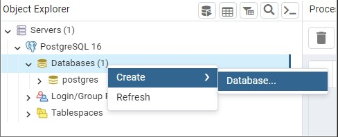
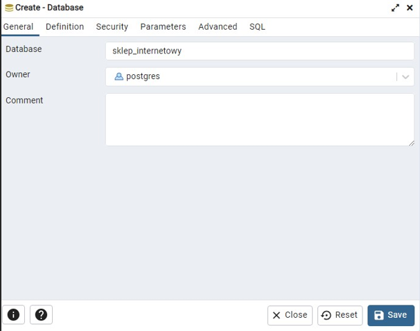
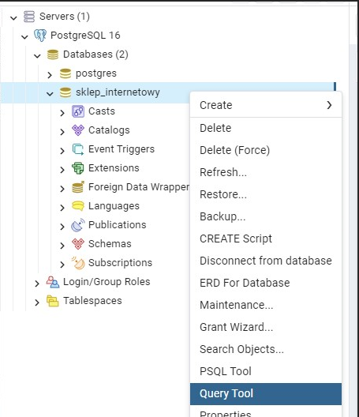
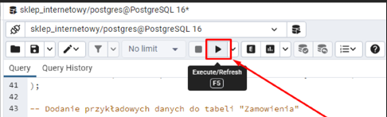
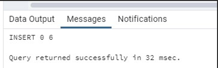
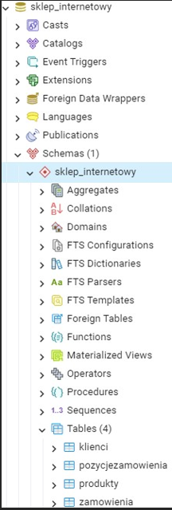
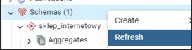
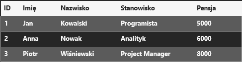
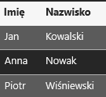

# Laboratorium 5 
## Bazy Danych 1 
### mgr. inż. Aleksander Wojtowicz 
 
 
### SQL (Structured Query Language) 
to język programowania używany do zarządzania danymi w relacyjnych bazach danych. Jest to narzędzie umożliwiające komunikację z bazą danych, dodawanie, pobieranie, aktualizowanie i usuwanie danych. 
 
### Rola SQL w zarządzaniu relacyjnymi bazami danych: 
1.	Definiowanie danych: SQL umożliwia tworzenie tabel, określanie relacji między nimi oraz definiowanie ograniczeń, takich jak unikalność czy klucze obce. 

2.	Manipulacja danymi: Pozwala na dodawanie nowych danych do bazy (INSERT), pobieranie danych (SELECT), aktualizację danych (UPDATE) oraz usuwanie danych (DELETE). 

3.	Zapytania: SQL umożliwia formułowanie skomplikowanych zapytań, które pozwalają na wybieranie konkretnych danych z bazy zgodnie z określonymi kryteriami. 

4.	Zarządzanie transakcjami: SQL obsługuje transakcje, czyli operacje, które są albo w całości zatwierdzone, albo całkowicie odrzucone. To pomaga utrzymać spójność danych w bazie. 

5.	Bezpieczeństwo: SQL umożliwia kontrolę dostępu do danych poprzez określanie uprawnień użytkowników do różnych tabel czy operacji. 
 
### Terminologia SQL: 
1.	Tabela: Struktura, która przechowuje dane w formie wierszy i kolumn. 

2.	Klucz główny (Primary Key): Unikalny identyfikator dla każdego rekordu w tabeli. 

3.	Klucz obcy (Foreign Key): Klucz, który łączy rekordy w dwóch tabelach, umożliwiając relacje między nimi. 

4.	Zapytanie (Query): Instrukcja SQL używana do pobierania lub modyfikowania danych w bazie danych. 

5.	Transakcja: Jednostka pracy, która składa się z jednego lub więcej poleceń SQL, 
	które muszą być wykonane razem. 	q

### Najważniejsze Typy Danych w SQL: 
1.	VARCHAR (Variable Character): Przechowuje tekst o zmiennej długości, na przykład imiona czy opisy. 

2.	INT (Integer): Przechowuje liczby całkowite, używane na ogół do reprezentacji wieku, identyfikatorów itp. 

3.	DECIMAL(p, s): Służy do przechowywania liczb zmiennoprzecinkowych, gdzie:  

•	p to łączna liczba cyfr,  

•	s to liczba cyfr po przecinku.  

**Często używane do reprezentacji wartości finansowych.** 

4.	DATE: Przechowuje daty, co jest istotne przy śledzeniu informacji czasowych, na przykład daty zatrudnienia. 

5.	BOOL (Boolean): Przechowuje wartości logiczne, takie jak 'TRUE' lub 'FALSE', co jest przydatne do reprezentacji stanów logicznych, na przykład, czy pracownik jest zatrudniony. 

6.	CHAR(n) (Character): Przechowuje znaki o stałej długości n, co może być używane do kodów pocztowych czy innych danych o stałej strukturze. 

7.	TIMESTAMP: Przechowuje daty i czasy, co jest przydatne do śledzenia, kiedy dokonano modyfikacji danych. 

8.	BLOB (Binary Large Object): Przechowuje binarne dane, takie jak obrazy czy pliki. 

Jest używane do przechowywania niestrukturyzowanych informacji. 
 
Tworzymy nową bazę danych w pgAdmin. 
  
 <br>
 
Wpisujemy dowolną nazwę i klikamy Save 
  
 <br>
 
Prawym przyciskiem myszy klikamy na utworzoną przez nas bazę danych i wybieramy Query Tool. 

  <br>
  
Kopiujemy poniższy kod (kod jest również przesłany w pliku): 
```
-- Tworzenie schematu "sklep_internetowy" CREATE SCHEMA sklep_internetowy; 
 
-- Tworzenie tabeli Klienci CREATE TABLE sklep_internetowy.klienci ( 
    IDKlienta INT PRIMARY KEY, 
    Imie VARCHAR(50), 
    Nazwisko VARCHAR(50), 
    Email VARCHAR(100) 
); 
 
-- Dodanie przykładowych danych do tabeli "Klienci" INSERT INTO sklep_internetowy.klienci (IDKlienta, Imie, 
Nazwisko, Email) VALUES 
(1, 'John', 'Smith', 'john@example.com'), 
(2, 'Alice', 'Johnson', 'alice@example.com'), 
(3, 'Emma', 'Davis', 'emma@example.com'), 
(4, 'Michael', 'Brown', 'michael@example.com'); 
 ```
```
-- Tworzenie tabeli "Produkty" CREATE TABLE sklep_internetowy.produkty ( 
    IDProduktu INT PRIMARY KEY, 
    NazwaProduktu VARCHAR(50), 
    Cena DECIMAL(8,2) 
); 
 
-- Dodanie przykładowych danych do tabeli "Produkty" INSERT INTO sklep_internetowy.produkty (IDProduktu, 
NazwaProduktu, Cena) VALUES 
(101, 'Laptop', 1200.00), 
(102, 'Smartphone', 500.00), 
(103, 'Słuchawki', 80.00), 
(104, 'Tablet', 800.00), 
(105, 'Monitor', 300.00), 
(106, 'Mysz', 25.00); 
 
-- Tworzenie tabeli "Zamowienia" CREATE TABLE sklep_internetowy.zamowienia (     IDZamowienia INT PRIMARY KEY, 
    IDKlienta INT, 
    DataZamowienia TIMESTAMP, 
    FOREIGN KEY (IDKlienta) REFERENCES sklep_internetowy.klienci(IDKlienta) 
); 
 
-- Dodanie przykładowych danych do tabeli "Zamowienia" INSERT INTO sklep_internetowy.zamowienia (IDZamowienia, 
IDKlienta, DataZamowienia) VALUES 
(501, 1, '2023-01-15 10:30:00'), 
(502, 2, '2023-01-16 12:45:00'), 
(503, 3, '2023-01-17 14:20:00'), 
(504, 4, '2023-01-18 16:35:00'); 
 
-- Tworzenie tabeli "PozycjeZamowienia" CREATE TABLE sklep_internetowy.pozycjeZamowienia (     IDPozycjiZamowienia INT PRIMARY KEY, 
    IDZamowienia INT, 
    IDProduktu INT, 
    Ilosc INT, 
    FOREIGN KEY (IDZamowienia) REFERENCES sklep_internetowy.zamowienia(IDZamowienia), 
    FOREIGN KEY (IDProduktu) REFERENCES sklep_internetowy.produkty(IDProduktu) 
); 
 
-- Dodanie przykładowych danych do tabeli
"PozycjeZamowienia"
```
```
INSERT INTO sklep_internetowy.pozycjeZamowienia (IDPozycjiZamowienia, IDZamowienia, IDProduktu, Ilosc) 
VALUES 
(1, 501, 101, 2), 
(2, 502, 102, 1), 
(3, 502, 103, 3), 
(4, 503, 104, 1), 
(5, 503, 105, 2), 
(6, 504, 106, 4);
```
 
Naciskamy przycisk „Execute”. 

<br>
 
Jeżeli wszystko wykonało się poprawnie otrzymamy informację: 
Query returned successfully... 

<br>
 
Teraz w sklep_internetowy -> Schema -> sklep_internetowy znajdują się 4 tabele. 

<br>
   
W przypadku, gdyby w Schema nie pokazał się schemat „sklep_internetowy”, a Query wykonało się poprawnie należy kliknąć Refresh. 

<br>
  
**SELECT** pozwala wybierać konkretne dane z bazy danych, takie jak kolumny lub wiersze, aby zobaczyć tylko te informacje, które są potrzebne. 
 
 
Przyjmijmy tabelę zawierającą informacje o pracownikach w firmie. 

<br>

Teraz, chcemy użyć SELECT, aby zobaczyć tylko imiona i nazwiska pracowników. 
```
 SELECT Imię, Nazwisko FROM Pracownicy;
```
 
•	`SELECT`  	: Wybiera dane z bazy danych. 

•	Imię, Nazwisko : Kolumny chcemy wybrać. 

•	`FROM`   	: Z jakiej tabeli (Pracownicy) mają być pobrane dane. 
 
Wynik powyższego zapytania wyglądał by tak: 

<br> 
 
`SELECT *` , oznacza "pokaż wszystkie kolumny" dla każdego rekordu w danej tabeli.  
 
Użycie `SELECT * FROM Pracownicy;` spowoduje zwrócenie wszystkich kolumn i danych dla każdego pracownika z tabeli **"Pracownicy"** (ID, Imię, Nazwisko, Stanowisko, Pensja). 
 
## Zadania 
 
### Zadanie 1:  
Zaimportuj bazę danych „sklep_internetowy”. 
 
### Zadanie 2:  
Otwórz schemat ERD dla swojej bazy danych, klikając prawym przyciskiem myszy na jej nazwę. 
 
### Zadanie 3:  
Wyświetl wszystkie dane dla każdej tabeli, klikając prawym przyciskiem myszy na nią i wybierając `View/Edit Data`.  
 
### Zadanie 4:  
Używając poleceń `SELECT`, wyświetl wszystkie dane i kolumny dla każdej tabeli. 
 
### Zadanie 5:  
Używając polecenia `SELECT`, wyświetl jedynie nazwę i cenę produktów. 
 
### Zadanie 6:  
Używając polecenia `SELECT`, wyświetl id zamówienia i datę zamówienia dla tabeli zamówień. 
 
 
