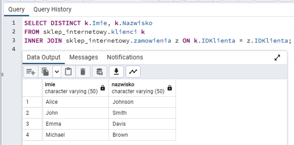
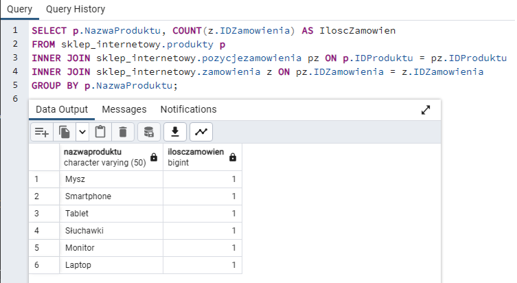
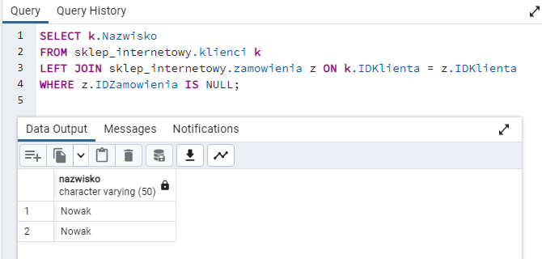
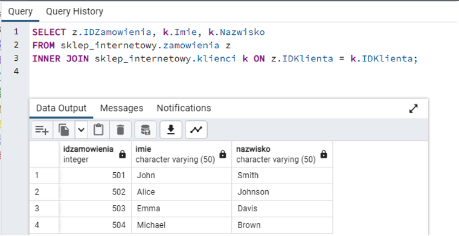
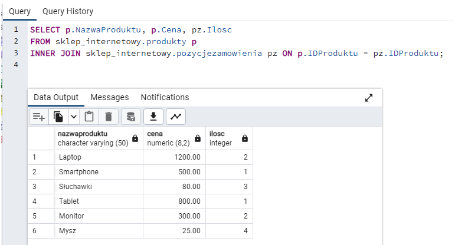
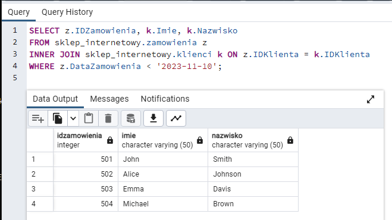
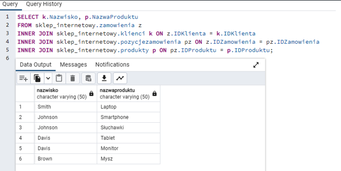
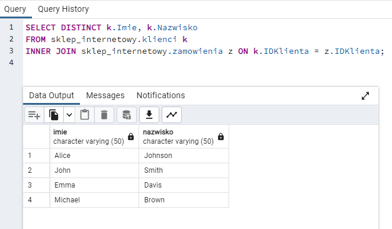
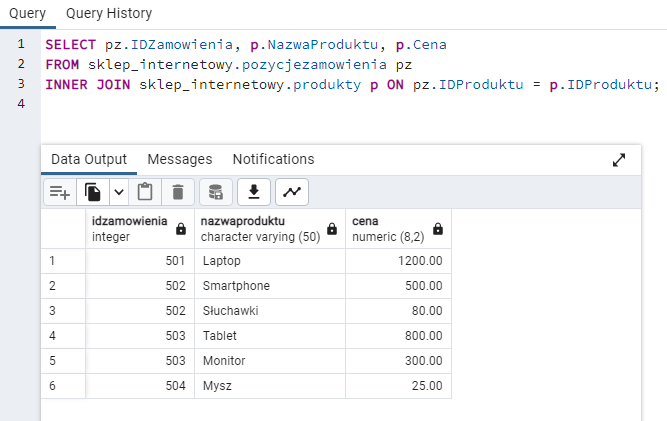
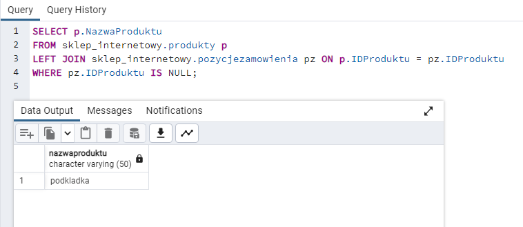

# Zadania

### Zadanie 1.
Znajdź wszystkich klientów, którzy dokonali zakupów (mają zamówienia) w sklepie internetowym.

### Zadanie 2.
(COUNT, GROUP BY) Wyświetl nazwy produktów i ilość zamówień dla każdego produktu.

### Zadanie 3.
Znajdź klientów, którzy nie dokonali jeszcze zakupów w sklepie internetowym.

### Zadanie 4.
Pokaż wszystkie zamówienia wraz z danymi klienta dla każdego zamówienia.

### Zadanie 5.
Wyświetl nazwy produktów, które zostały zamówione, wraz z ceną i ilością zamówionych sztuk.

### Zadanie 6.
Znajdź zamówienia złożone przed daną datą wraz z danymi klienta.

### Zadanie 7.
(3x INNER JOIN) Wyświetl nazwiska klientów i nazwy produktów dla każdego zamówienia.

### Zadanie 8.
(DISTINCT) Znajdź klientów, którzy złożyli co najmniej jedno zamówienie w sklepie internetowym.

### Zadanie 9.
Pokaż wszystkie pozycje zamówienia wraz z nazwą produktu i ceną dla każdej pozycji.

### Zadanie 10.
Znajdź produkty, które nie zostały jeszcze zamówione.

# Odpowiedzi: 

### Zadanie 1:
Znajdź wszystkich klientów, którzy dokonali zakupów (mają zamówienia) w sklepie internetowym.

   

### Zadanie 2:
(COUNT, GROUP BY) Wyświetl nazwy produktów i ilość zamówień dla każdego produktu.

    

### Zadanie 3:
Znajdź klientów, którzy nie dokonali jeszcze zakupów w sklepie internetowym.

    

### Zadanie 4:
Pokaż wszystkie zamówienia wraz z danymi klienta dla każdego zamówienia.

    

### Zadanie 5:
Wyświetl nazwy produktów, które zostały zamówione, wraz z ceną i ilością zamówionych sztuk.

    

### Zadanie 6:
Znajdź zamówienia złożone przed daną datą wraz z danymi klienta.

    

### Zadanie 7:
(3x INNER JOIN) Wyświetl nazwiska klientów i nazwy produktów dla każdego zamówienia.

   
 
### Zadanie 8:
(DISTINCT) Znajdź klientów, którzy złożyli co najmniej jedno zamówienie w sklepie internetowym.

    

### Zadanie 9:
Pokaż wszystkie pozycje zamówienia wraz z nazwą produktu i ceną dla każdej pozycji.

    

### Zadanie 10:
Znajdź produkty, które nie zostały jeszcze zamówione.

   
 
