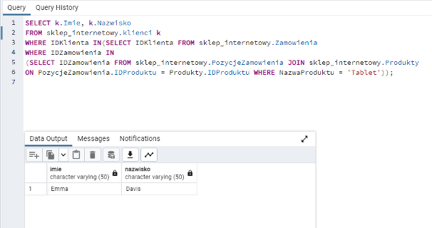
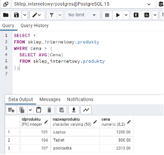
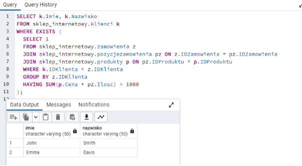
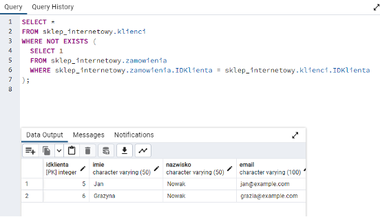
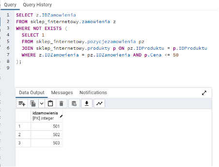
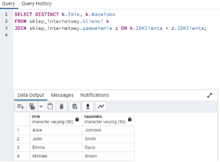
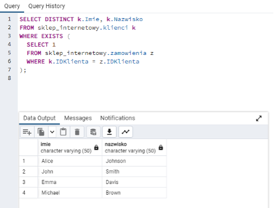
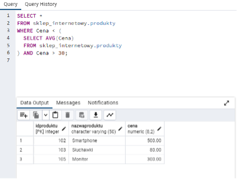
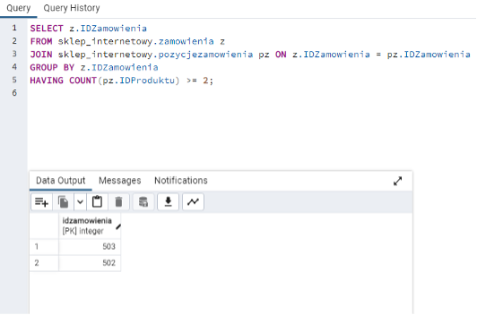
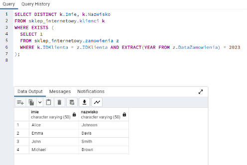

# Zadania

### 1.	Znajdź klientów, którzy dokonali zakupów produktu o nazwie 'Tablet'. 
### 2.	Znajdź produkty, których cena jest wyższa niż średnia cena produktów. 
### 3.	Znajdź klientów, którzy dokonali zakupów za kwotę przekraczającą 1000 zł. 
### 4.	Znajdź klientów, którzy nie dokonali jeszcze żadnych zakupów. 
### 5.	Znajdź zamówienia, w których każdy produkt kosztuje więcej niż 50 zł. 
### 6.	Znajdź klientów, którzy dokonali zakupów za pomocą podzapytania z JOIN. 
### 7.	Znajdź klientów, którzy dokonali przynajmniej jednego zamówienia. 
### 8.	Znajdź produkty tańsze niż średnia cena produktów, ale droższe niż 30 zł. 
### 9.	Znajdź zamówienia z co najmniej dwoma pozycjami. 
### 10.	Znajdź klientów, którzy dokonali zakupów w 2023 roku. 

# Odpowiedzi:

### Zadanie 1. 
Znajdź klientów, którzy dokonali zakupów produktu o nazwie 'Tablet'. 

    

### Zadanie 2. 
Znajdź produkty, których cena jest wyższa niż średnia cena produktów. 

    

### Zadanie 3. 
Znajdź klientów, którzy dokonali zakupów za kwotę przekraczającą 1000 zł. 

    

### Zadanie 4.
 Znajdź klientów, którzy nie dokonali jeszcze żadnych zakupów. 

    

### Zadanie 5.
 Znajdź zamówienia, w których każdy produkt kosztuje więcej niż 50 zł. 

    

### Zadanie 6. 
Znajdź klientów, którzy dokonali zakupów za pomocą podzapytania z JOIN. 

    

### Zadanie 7.
 Znajdź klientów, którzy dokonali przynajmniej jednego zamówienia. 

    

### Zadanie 8. 
Znajdź produkty tańsze niż średnia cena produktów, ale droższe niż 30 zł. 

    

### Zadanie 9.
 Znajdź zamówienia z co najmniej dwoma pozycjami. 

    

### Zadanie 10.
 Znajdź klientów, którzy dokonali zakupów w 2023 roku.

 
   

