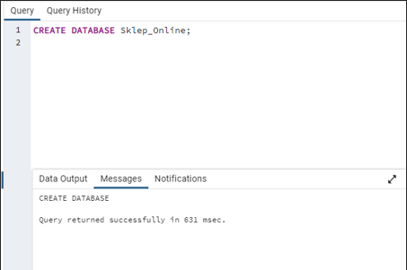
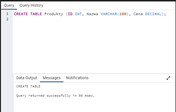
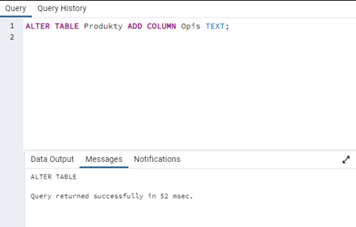
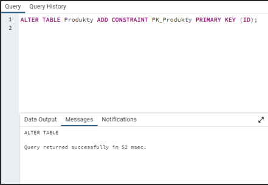
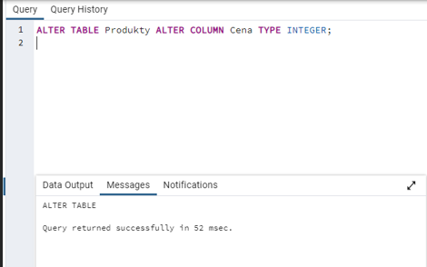
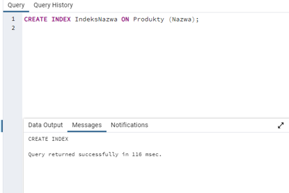
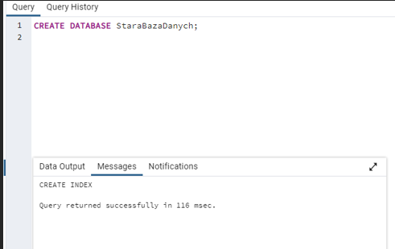
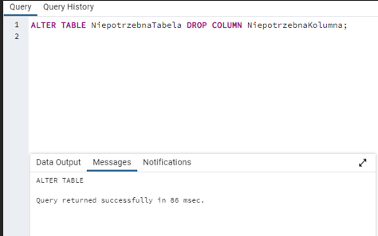
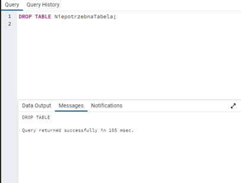

# Zadania 
### Zadanie 1.	
Utwórz nową bazę danych o nazwie "SklepOnline". 
### Zadanie 2.	
Utwórz nową tabelę "Produkty" z kolumnami: ID, Nazwa, Cena. 
### Zadanie 3.	
Dodaj nową kolumnę "Opis" do tabeli "Produkty". 
### Zadanie 4.	
Dodaj klucz główny "ID" do tabeli "Produkty". 
### Zadanie 5.	
Zmień typ danych kolumny "Cena" na INTEGER w tabeli "Produkty". 
### Zadanie 6. 
Utwórz indeks "IndeksNazwa" dla kolumny "Nazwa" w tabeli 
"Produkty". 
### Zadanie 7.	
Stwórz bazę danych "StaraBazaDanych", z tabelą 
„NiepotrzebnaTabela”, która ma „NiepotrzebnaKolumna”. 
### Zadanie 8.	
Usuń kolumnę "NiepotrzebnaKolumna" z tabeli "NiepotrzebnaTabela". 
### Zadanie 9.	
Usuń tabelę "StaraTabela" z bazy danych. 10. 	Usuń bazę danych "StaraBazaDanych". 

# Odpowiedzi:
### Zadanie 1. 
Utwórz nową bazę danych o nazwie "SklepOnline". 

     

### Zadanie 2.
 Utwórz nową tabelę "Produkty" z kolumnami: ID, Nazwa, Cena.

     

### Zadanie 3.
 Dodaj nową kolumnę "Opis" do tabeli "Produkty". 

    

### Zadanie 4.
 Dodaj klucz główny "ID" do tabeli "Produkty". 

     

### Zadanie 5. 
Zmień typ danych kolumny "Cena" na INTEGER w tabeli "Produkty".

     
 
### Zadanie 6.
 Utwórz indeks "IndeksNazwa" dla kolumny "Nazwa" w tabeli "Produkty". 

     

### Zadanie 7.
 Stwórz bazę danych "StaraBazaDanych", z tabelą „NiepotrzebnaTabela”, która ma „NiepotrzebnaKolumna”. 

     
   
     

### Zadanie 8. 
Usuń kolumnę "NiepotrzebnaKolumna" z tabeli "NiepotrzebnaTabela". 

    

### Zadanie 9. 
Usuń tabelę "StaraTabela" z bazy danych. 

     

### Zadanie 10.
Usuń bazę danych "StaraBazaDanych".

     
