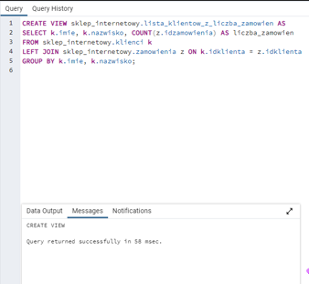
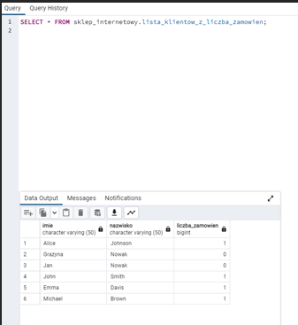
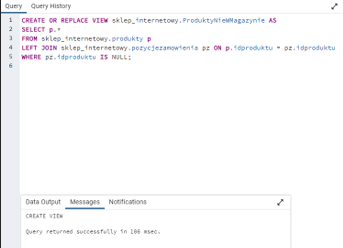
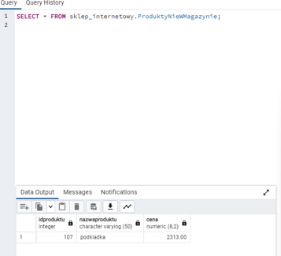
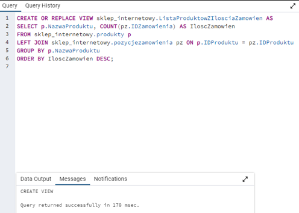
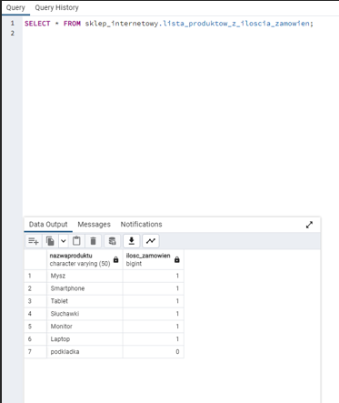
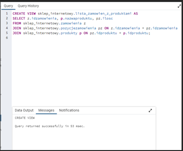
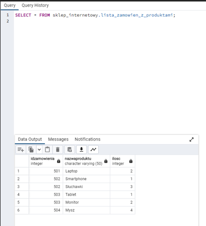
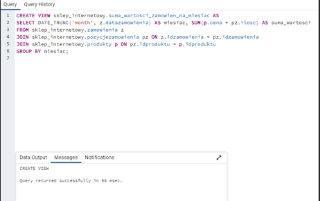
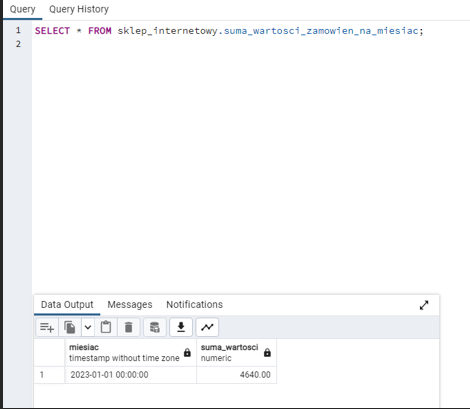

# Zadania 

### Zadanie 1.	
Stwórz widok, który przedstawia listę klientów wraz z ich imionami, nazwiskami oraz liczbą dokonanych zamówień. 

### Zadanie 2.	
Stwórz widok, który przedstawia produkty, których `IDProduktu` nie znajduje się w tabeli `pozycjeZamówienia`. 
(podpowiedź: `LEFT JOIN`, `IS NULL`) 

### Zadanie 3.	
Stwórz widok, który przedstawia listę produktów wraz z ich nazwami i ilością zamówień, posortowaną malejąco według ilości zamówień. 

### Zadanie 4.	
Stwórz widok, który przedstawia listę zamówień wraz z nazwami produktów i ilościami zamówionych produktów. 

### Zadanie 5.	
Stwórz widok, który przedstawia sumę wartości zamówień dla każdego miesiąca. 
(podpowiedź: `DATE_TRUNC('month', z.DataZamowienia) AS Miesiac)` 

# Odpowiedzi:

### Zadanie 1.
 Stwórz widok, który przedstawia listę klientów wraz z ich imionami, nazwiskami oraz liczbą dokonanych zamówień. 

    
    

### Zadanie 2. 
Stwórz widok, który przedstawia produkty, których aktualnie nie ma w magazynie. 

     
     

### Zadanie 3. 
Stwórz widok, który przedstawia listę produktów wraz z ich nazwami i ilością zamówień, posortowaną malejąco według ilości zamówień. 

 
  
 
### Zadanie 4.
 Stwórz widok, który przedstawia listę zamówień wraz z nazwami produktów i ilościami zamówionych produktów. 

    
    

### Zadanie 5.
 Stwórz widok, który przedstawia sumę wartości zamówień dla każdego miesiąca.

  
  
