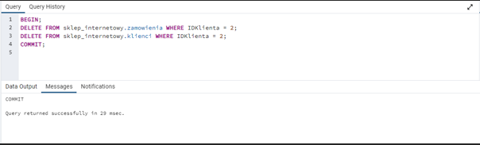

# Zadania:

## 1.Dodawanie nowego zamówienia z kilkoma pozycjami:
## 1.1. Rozpocznij transakcję.
## 1.2. Dodaj nowe zamówienie dla istniejącego klienta (np. IDKlienta = 1) w tabeli "Zamowienia".
## 1.3. Dodaj kilka pozycji do nowego zamówienia (np. produkt o IDProduktu = 102 i ilość 2, produkt o IDProduktu = 104 i ilość 1).
## 1.4. Zakończ transakcję.
## 2. Usuwanie zamówień i pozycji zamówienia starszych niż 7 dni:
## 2.1. Rozpocznij transakcję.
## 2.2. Usuń zamówienia z tabeli "Zamowienia" i ich pozycje z tabeli "PozycjeZamowienia", które są starsze niż 7 dni.
## 2.3. Zakończ transakcję.
## 3. Aktualizacja nazwy klienta i jego e-maila w ramach jednej transakcji
## 3.1. Rozpocznij transakcję.
## 3.2. Aktualizuj nazwę klienta o ID 2 na "Alicja Nowak" oraz e-mail na 'alicja.nowak@example.com'.
## 3.3. Zakończ transakcję.
## 4. Usunięcie wszystkich zamówień danego klienta i jego danych z tabeli klientów w ramach jednej transakcji
## 4.1. Rozpocznij transakcję.
## 4.2. Usuń wszystkie zamówienia klienta o IDKlienta = 2 z tabeli "Zamowienia".
## 4.3. Usuń klienta o IDKlienta = 2 z tabeli "Klienci".
## 4.4. Zakończ transakcję.

# Odpowiedzi:

## Zadanie 1.
Dodawanie nowego zamówienia z kilkoma pozycjami:
1.1 Rozpocznij transakcję.
1.2 Dodaj nowe zamówienie dla istniejącego klienta (np. IDKlienta = 1) w tabeli "Zamowienia".
1.3 Dodaj kilka pozycji do nowego zamówienia (np. produkt o IDProduktu = 102 i ilość 2, produkt o IDProduktu = 104 i ilość 1).
1.4 Zakończ transakcję.

    

## Zadanie 2.
Usuwanie zamówień i pozycji zamówienia starszych niż 7 dni:
2.1	Rozpocznij transakcję.
2.2 Usuń zamówienia z tabeli "Zamowienia" i ich pozycje z tabeli "PozycjeZamowienia", które są starsze niż 7 dni.
2.3 Zakończ transakcję.

    

## Zadanie 3.
Aktualizacja nazwy klienta i jego e-maila w ramach jednej transakcji
3.1	Rozpocznij transakcję.
3.2	Aktualizuj nazwę klienta o ID 2 na "Alicja Nowak" oraz e-mail na 'alicja.nowak@example.com'.
3.3	Zakończ transakcję.

    

## Zadanie 4.
Usunięcie wszystkich zamówień danego klienta i jego danych z tabeli klientów w ramach jednej transakcji
4.1	Rozpocznij transakcję.
4.2	Usuń wszystkie zamówienia klienta o IDKlienta = 2 z tabeli "Zamowienia".
4.3	Usuń klienta o IDKlienta = 2 z tabeli "Klienci".
4.4 Zakończ transakcję.

   

## WYNIKI TABEL PO WSZYSTKICH DZIAŁANIACH:

    
     
 
