# Laboratorium 12
## Bazy Danych 1
### mgr. inż. Aleksander Wojtowicz
### Zadanie 1.1: Proste zapytanie SELECT
Napisz zapytanie SQL, które wybierze wszystkie dane z tabeli "Klienci".

 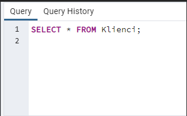 

### Zadanie 1.2: Filtrowanie wyników zapytania
Napisz zapytanie SQL, które wybierze imię, nazwisko i email klientów, którzy złożyli zamówienia.

 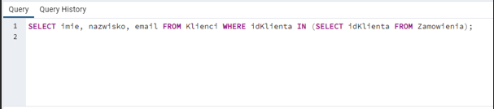 

### Zadanie 1.3: Sortowanie wyników
Napisz zapytanie SQL, które wybierze nazwiska klientów posortowane alfabetycznie.

 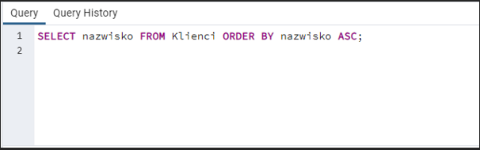 

### Zadanie 2.1: Dodawanie nowego produktu
Dodaj do tabeli "Produkty" nowy produkt o nazwie "Klawiatura" i cenie 50.00.

 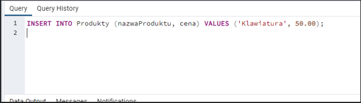 

### Zadanie 2.2: Aktualizacja danych
Zaktualizuj cenę produktu o nazwie "Słuchawki" na 90.00.

 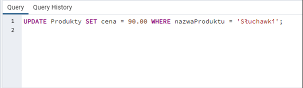 

### Zadanie 2.3: Usuwanie danych
Usuń klienta o ID równym 2 z tabeli "Klienci".

 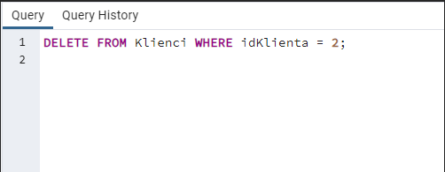 

### Zadanie 3.1: Inner Join
Napisz zapytanie SQL, które połączy tabelę "Zamowienia" z tabelą "Klienci" i wybierze imię, nazwisko oraz datę zamówienia.

 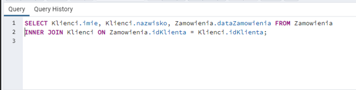 

### Zadanie 3.2: Left Join
Napisz zapytanie SQL, które pokaże wszystkie produkty (nazwa i cena), nawet jeśli nie zostały jeszcze zamówione.

 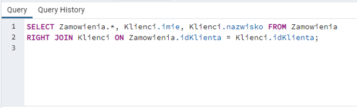 

### Zadanie 3.3: Right Join
Napisz zapytanie SQL, które pokaże wszystkie zamówienia wraz z danymi klienta, nawet jeśli klient nie złożył jeszcze zamówienia.

  

### Zadanie 4.1: Proste podzapytanie
Napisz zapytanie SQL, które wybierze wszystkich klientów, którzy złożyli zamówienie.

 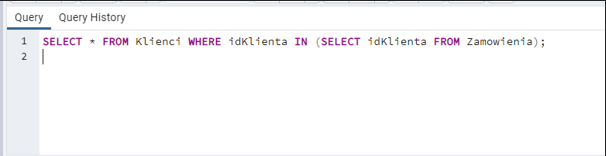 

### Zadanie 4.2: Zapytanie zagnieżdżone
Napisz zapytanie SQL, które wybierze nazwy produktów, których cena przekracza średnią cenę produktów.

 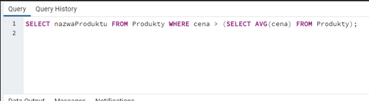 

### Zadanie 4.3: Wykorzystanie podzapytań do aktualizacji danych
Zaktualizuj cenę wszystkich produktów, które zostały zamówione więcej niż 2 razy.

 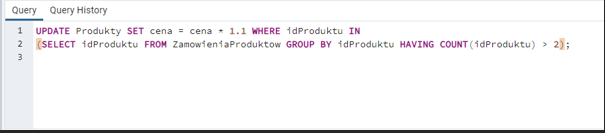 

### Zadanie 5.1: Tworzenie nowej tabeli
Stwórz nową tabelę "KategorieProduktow" zawierającą IDKategorii i NazwaKategorii.

 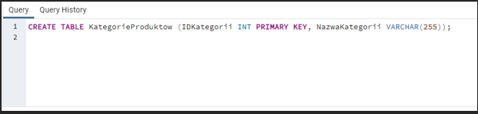 

### Zadanie 5.2: Dodawanie klucza obcego
Dodaj klucz obcy "IDKategorii" do tabeli "Produkty", wskazujący na tabelę "KategorieProduktow".

 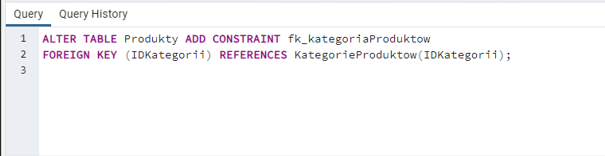 

### Zadanie 5.3: Dodawanie indeksu
Dodaj indeks do kolumny "NazwaProduktu" w tabeli "Produkty" w celu przyspieszenia wyszukiwania.

 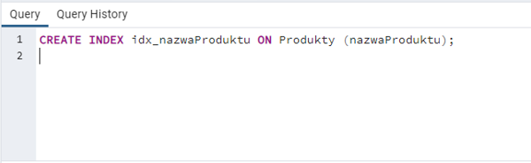 

### Zadanie 6.1: Tworzenie widoku
Stwórz widok "ZamowieniaKlientow" zawierający IDZamowienia, Imie, Nazwisko i DataZamowienia.

 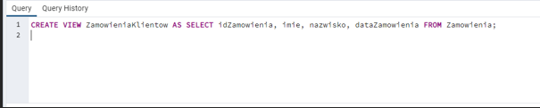 

### Zadanie 6.2: Aktualizacja widoku
Zaktualizuj widok "ZamowieniaKlientow" tak, aby uwzględniał także nazwy zamówionych produktów.

 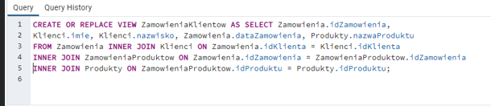 

(CREATE OR REPLACE VIEW)
### Zadanie 6.3: Usuwanie widoku
Usuń widok "ZamowieniaKlientow".

 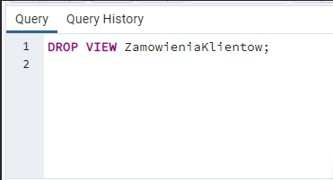 
