# ZADANIA

### Zadanie 1:  
Zaimportuj bazę danych „sklep_internetowy”. 
 
### Zadanie 2:  
Otwórz schemat ERD dla swojej bazy danych, klikając prawym przyciskiem myszy na jej nazwę. 
 
### Zadanie 3:  
Wyświetl wszystkie dane dla każdej tabeli, klikając prawym przyciskiem myszy na nią i wybierając `View/Edit Data`.  
 
### Zadanie 4:  
Używając poleceń `SELECT`, wyświetl wszystkie dane i kolumny dla każdej tabeli. 
 
### Zadanie 5:  
Używając polecenia `SELECT`, wyświetl jedynie nazwę i cenę produktów. 
 
### Zadanie 6:  
Używając polecenia `SELECT`, wyświetl id zamówienia i datę zamówienia dla tabeli zamówień. 
 
 # ODPOWIEDZI

## Zadanie 1:
Zaimportuj bazę danych „sklep_internetowy”.

   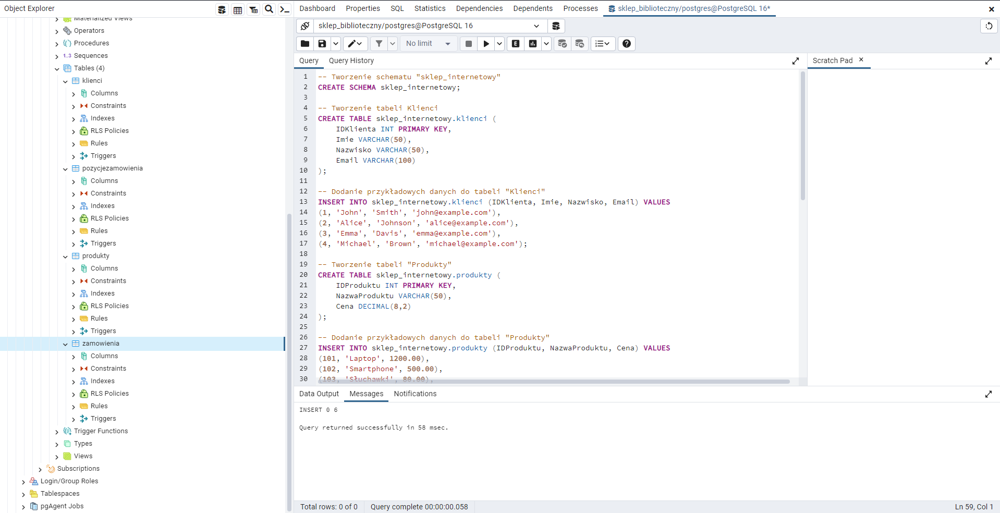
  
## Zadanie 2:
Otwórz schemat ERD dla swojej bazy danych, klikając prawym przyciskiem myszy na jej nazwę.

  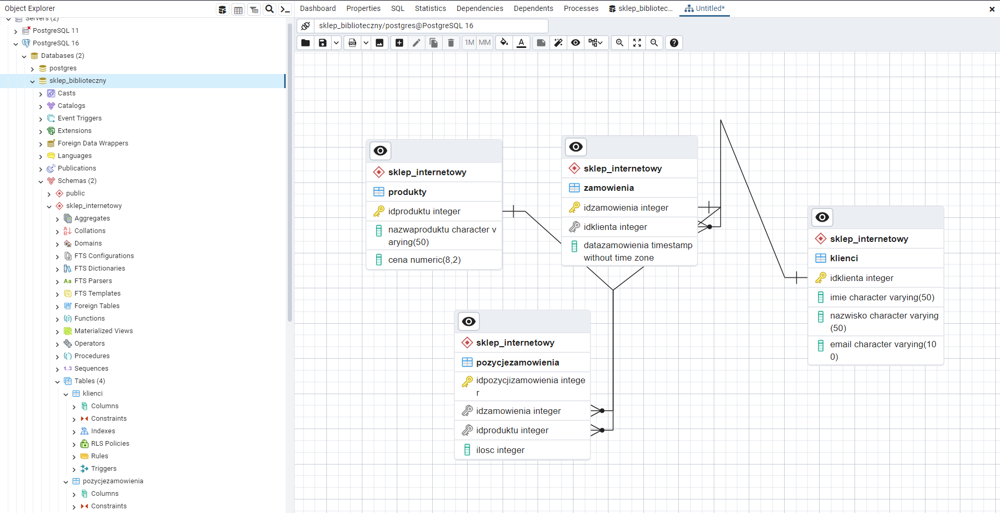

## Zadanie 3:
Wyświetl wszystkie dane dla każdej tabeli, klikając prawym przyciskiem myszy na nią i wybierając View/Edit Data.

  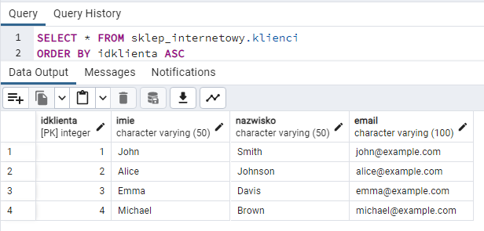
   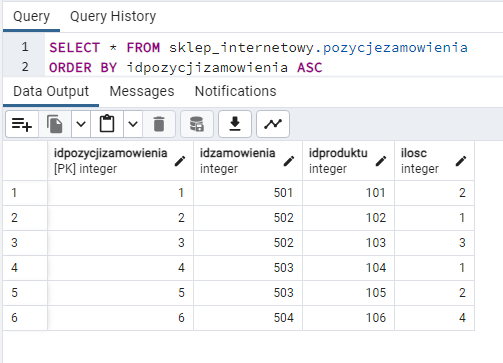
    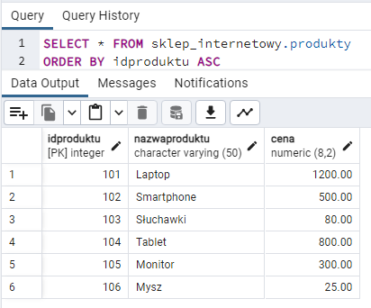
     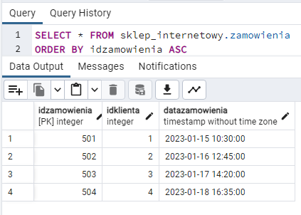
 
## Zadanie 4:
Używając poleceń SELECT, wyświetl wszystkie dane i kolumny dla każdej tabeli.

  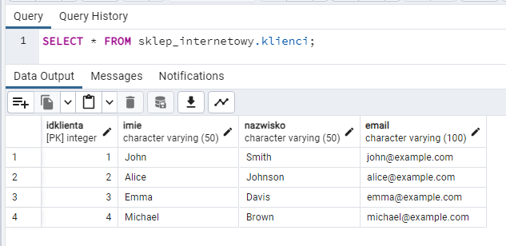
   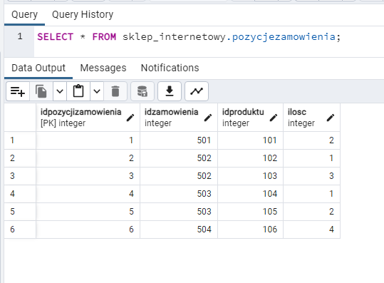
    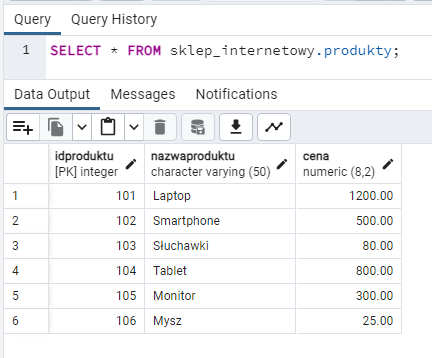
     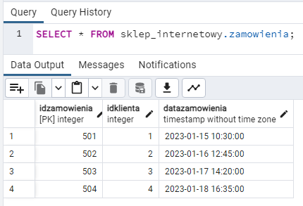 

##Zadanie 5:
Używając polecenia SELECT, wyświetl jedynie nazwę i cenę produktów.

   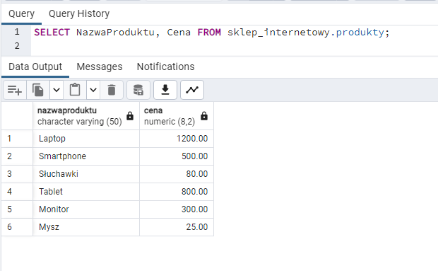

## Zadanie 6:
Używając polecenia SELECT, wyświetl id zamówienia i datę zamówienia dla tabeli zamówień.
 
  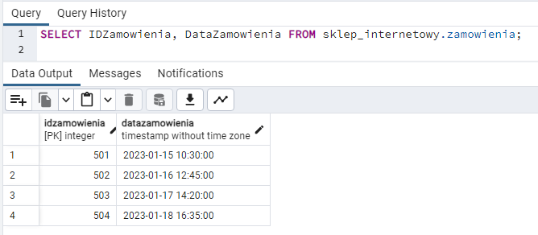
