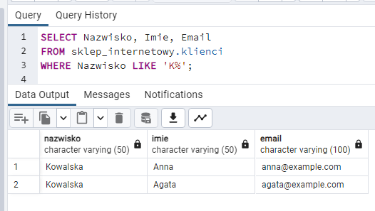
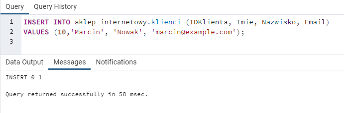
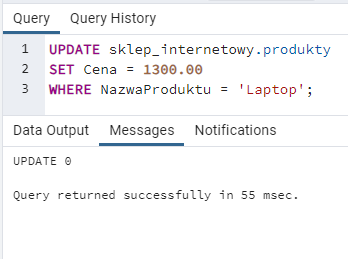
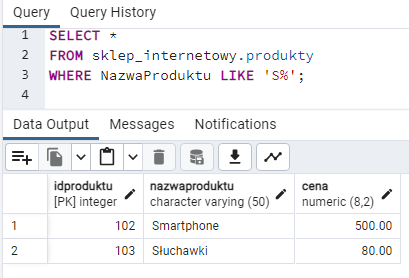
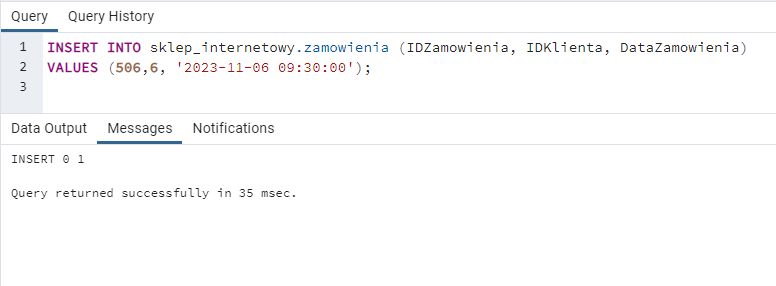
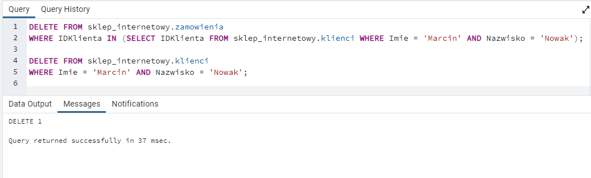
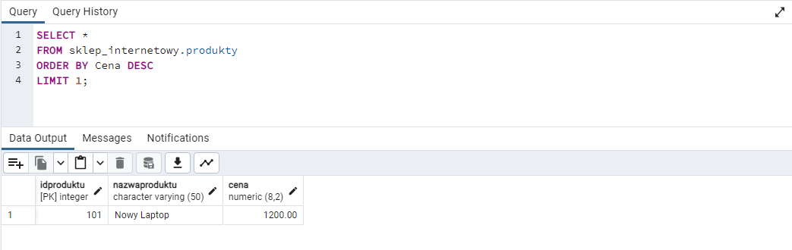

# Zadania
Przetestuj wszystkie komendy z laboratorium, następnie na ich podstawie wykonaj poniższe zadania.
### Zadanie 1:
Wybierz nazwiska, imiona oraz adresy e-mail klientów, których nazwiska zaczynają się na literę `K`.
### Zadanie 2:
Dodaj nowego klienta o imieniu '`Marcin`', nazwisku '`Nowak`' i adresie email '`marcin@example.com`'.
### Zadanie 3:
Zaktualizuj cenę produktu '`Laptop`' na 1300.00 zł:
### Zadanie 4:
Wybierz produkty o nazwach zaczynających się na literę '`S`'.
### Zadanie 5:
Dodaj nowe zamówienie dla klienta o `IDKlienta=6` z datą '`2023-11-06 09:30:00`'.
### Zadanie 6:
Usuń klienta Marcina Nowaka (pamiętaj najpierw o usunięciu powiązanych zamówień).
### Zadanie 7:
Znajdź najdroższy produkt w tabeli 'produkty'.

Użyj `ORDER BY`: Aby posortować wyniki według konkretnej kolumny, użyj ORDER BY. W tym przypadku chcemy posortować po cenie, więc użyj ORDER BY Cena.

Użyj `DESC`: Aby posortować malejąco, ORDER BY Cena DESC. Rosnąco byłoby ASC.

Użyj `LIMIT`: Aby ograniczyć wyniki do jednego, użyj LIMIT 1.

# Odpowiedzi:
### Zadanie 1:
Wybierz nazwiska, imiona oraz adresy e-mail klientów, których nazwiska zaczynają się na literę K.

  

### Zadanie 2:
Dodaj nowego klienta o imieniu 'Marcin', nazwisku 'Nowak' i adresie email 'marcin@example.com'.

  
 
### Zadanie 3:
Zaktualizuj cenę produktu 'Laptop' na 1300.00 zł:

   

### Zadanie 4:
Wybierz produkty o nazwach zaczynających się na literę 'S'.

  
 
### Zadanie 5:
Dodaj nowe zamówienie dla klienta o IDKlienta=6 z datą '2023-11-06 09:30:00'.

  

### Zadanie 6:
Usuń klienta Marcina Nowaka (pamiętaj najpierw o usunięciu powiązanych zamówień).

  

### Zadanie 7:
Znajdź najdroższy produkt w tabeli 'produkty'.
Użyj ORDER BY: Aby posortować wyniki według konkretnej kolumny, użyj ORDER BY. W tym przypadku chcemy posortować po cenie, więc użyj ORDER BY Cena.
Użyj DESC: Aby posortować malejąco, ORDER BY Cena DESC. Rosnąco byłoby ASC.
Użyj LIMIT: Aby ograniczyć wyniki do jednego, użyj LIMIT 1.

  
 

